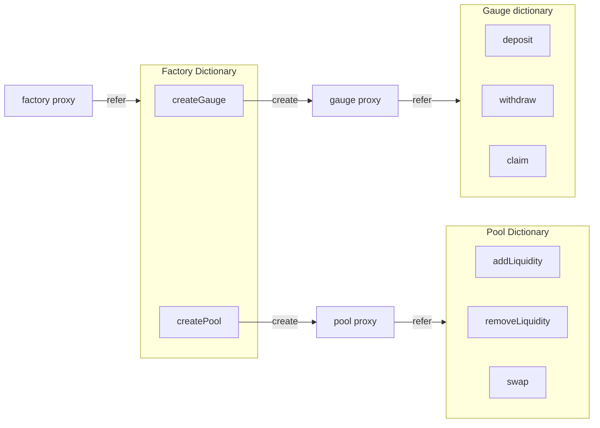

# Forkathon DEX
This repository houses Forkathon DEX, a rebuild of simplified AMM-DEX using the metacontract framework.

## Overview
This DEX repository is built on the metacontract framework and contains the following bundles and functions. 
Each bundle corresponds to a specific functionality or role within the DEX, with functions performing detailed operations within those bundles.

## ER diagram

## Bundles
### Factory
Responsible for creating unique liquidity pools for each token pair.

#### Functions
- createPool(address tokenA, address tokenB)
  - Generates a new liquidity pool for the specified token pair.
- getPool(address tokenA, address tokenB)
  - Retrieve the address of a liquidity pool.

### Pool
Manages liquidity pools for each token pair.

#### Functions
- addLiquidity(uint amountA, uint amountB)
  - Provides liquidity to the pool of the specified token pair.
- removeLiquidity(uint liquidity)
  - Removes liquidity from the pool and retrieves corresponding tokens.
- swap(uint amountAIn, uint amountBIn)
  - Executes a swap from token A to token B or vice versa.
  - Without slippage control, no fee collection.

### Gauge
Reward distribution system based on staking LP tokens.

#### Functions
- deposit(uint amount)
  - Deposit LP Token.
- withdraw(uint amount)
  - Withdraw LP Token.
- claim
  - Claim accumulated rewards based on the amount staked and the duration of the stake.

## Follow setup instructions
### Clone
```bash
git clone https://github.com/ecdysisxyz/forkathon-dex.git
cd forkathon-dex
```

### Install
```bash
forge install
```

### Prerequisites
- Foundry